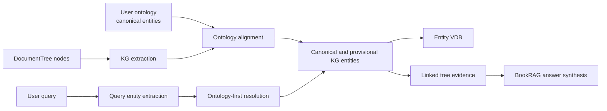

# BookRAG Architecture Review and Comparison with Three-Layer Fixed Entity Architecture

## 1. Purpose of This Document

This document explains how the current BookRAG application is implemented, how its retrieval pipeline works end to end, and how it compares with the "Three-Layer Fixed Entity Architecture" (FEA) pattern for graph-based RAG.

The goal is to answer three practical questions:

1. What is BookRAG doing today?
2. How is it similar to and different from FEA?
3. Can FEA ideas improve BookRAG, and if so, where?

## 2. Executive Summary

BookRAG is not a pure GraphRAG system and it is not an ontology-first system. It is better described as a **hybrid hierarchical-document + knowledge-graph + vector retrieval architecture** with query planning and multimodal answer generation.

Its strongest architectural characteristics are:

- **Document structure first**: PDF content is converted into a hierarchical `DocumentTree`.
- **Graph derived from structure**: the knowledge graph is extracted from tree nodes, not from flat chunks alone.
- **Hybrid retrieval**: answers are grounded using tree structure, graph connectivity, and vector similarity together.
- **Query-aware orchestration**: the system classifies queries into simple, complex, and global modes.
- **Multimodal answering**: text, tables, and images can all contribute to the final answer.

Compared with FEA, BookRAG already shares the idea that **entities bridge user questions and source evidence**. However, BookRAG does **not** currently implement a stable canonical ontology layer above extracted entities. That is the main conceptual gap.

## 3. What the Three-Layer Fixed Entity Architecture Means

The Three-Layer Fixed Entity Architecture is best understood as an **ontology-first graph RAG pattern** with three conceptual layers:

It does not appear to be a mainstream standard framework in the academic GraphRAG literature. In practice, it is more useful to treat it as a **design pattern** for domain-governed graph retrieval.

1. **Ontology / fixed entity layer**  
   Stable canonical entities, types, and controlled relationships.
2. **Document layer**  
   Source documents, passages, or chunks that contain evidence.
3. **Extracted entity / mention layer**  
   Mentions or extracted entities from documents, linked upward to canonical entities and downward to source evidence.

The design goal is to reduce noisy entity duplication, improve explainability, and make graph retrieval more precise in domain-specific settings.

## 4. High-Level BookRAG Architecture

At a high level, BookRAG has two major operating modes:

- **Offline indexing**: parse documents, build a structural tree, extract/refine a graph, and build vector resources.
- **Online RAG**: analyze the query, map it to graph/tree evidence, retrieve relevant substructures, and generate an answer.

Conceptually, the pipeline is:

`PDF -> parser -> refined PDF structure -> DocumentTree -> KG extraction/refinement -> Graph + tree-to-graph links -> vector indices -> query planning -> entity mapping -> section/subtree/subgraph retrieval -> reranking -> answer generation`

## 5. Main Implementation Surfaces

### 5.1 CLI entry point

`main.py` is the main batch and single-document entry point.

It supports:

- `index` mode for offline construction
- `rag` mode for inference
- staged indexing via `--stage`
- dataset-driven multi-document processing
- split-based processing for parallel workers
- config snapshotting and run logging

This makes the project operationally closer to a **pipeline system** than a demo-only chatbot.

### 5.2 API entry point

`api/main.py` exposes BookRAG as a FastAPI service with:

- startup config validation
- structured JSON logging
- request ID propagation
- MongoDB lifecycle/index management
- optional FalkorDB health checking
- routers for auth, tenants, documents, chat, and entities

This indicates the repository is designed for **multi-tenant application deployment**, not only offline experiments.

## 6. Core Data Structures

### 6.1 Document tree

`Core/Index/Tree.py` defines the structural backbone:

- `DocumentTree`
- `TreeNode`
- `NodeType`
- `MetaInfo`

This tree stores document hierarchy such as titles, sections, text blocks, tables, and images. It also supports subtree extraction, ancestor navigation, depth-aware traversal, and retrieval-friendly node serialization.

This is the first major difference from FEA: **BookRAG is tree-first, not ontology-first**.

### 6.2 Knowledge graph

`Core/Index/Graph.py` defines the graph layer:

- `Entity`
- `Relationship`
- `Graph`

The graph is backed by `networkx.Graph` in memory and can be saved or reconstructed through FalkorDB. A key implementation detail is the `tree2kg` mapping, which links structural document nodes to graph nodes.

That mapping is crucial because BookRAG does not retrieve graph evidence in isolation. It uses the graph to lead back into the source document structure.

### 6.3 Hybrid GBC index

`Core/Index/GBCIndex.py` packages the main retrieval assets into a unified object:

- tree index
- graph index
- entity vector database

This confirms that the production architecture is **hybrid by design**, rather than a single-layer graph database solution.

## 7. Offline Index Construction Flow

The main offline orchestration entry is `Core/construct_index.py`, which coordinates tree building, KG construction, GBC index creation, and vector resource rebuilding.

### 7.1 Tree construction

`Core/pipelines/doc_tree_builder.py` builds the `DocumentTree`.

Important behaviors include:

- parser selection between **Docling** and **MinerU**
- cache-aware parsing
- PDF refinement
- outline extraction
- legal heading detection
- optional node summary generation

This stage turns raw PDFs into a structured hierarchy that later retrieval can reason over.

### 7.2 KG construction

`Core/pipelines/kg_builder.py` extracts a graph from the tree.

Important characteristics:

- extraction is tree-node aware
- title nodes are handled differently from non-title nodes
- graph refinement supports at least `basic` and `advanced` modes
- post-processing refines both entities and relations

The key design principle is: **the graph is derived from the document tree rather than replacing it**.

### 7.3 Vector resources

After tree and graph construction, the system rebuilds vector resources, especially entity-oriented lookup resources used during query-to-graph mapping.

This gives BookRAG three retrieval surfaces at runtime:

1. document hierarchy
2. graph connectivity
3. semantic vector similarity

## 8. Online Retrieval and Answer Generation Flow

### 8.1 Inference orchestration

`Core/inference.py` prepares dependencies, creates the configured RAG agent, runs the query dataset, stores per-query outputs, and records token cost.

This operational layer is important because it shows BookRAG is structured as a repeatable evaluation pipeline, not only a live chat handler.

### 8.2 Main RAG implementation

The most representative runtime path is `Core/rag/gbc_rag.py`.

There is also a simpler `Core/rag/graph_rag.py`, but it is not the best file for understanding the full BookRAG architecture. The `GBCRAG` path is the real reference implementation for the current system design.

Its main logic combines:

- `TaskPlanner`
- `Retriever`
- `AnswerAgent`

This is significantly more advanced than a basic entity-hop graph retriever.

### 8.3 Query understanding

`Core/rag/gbc_plan.py` classifies queries into:

- `simple`
- `complex`
- `global`

Complex queries can be decomposed into sub-questions, while global queries can include filtering and aggregation logic.

This is one of BookRAG's strongest differentiators. FEA usually describes graph organization, but BookRAG also includes **query planning as a first-class runtime component**.

### 8.4 Query entity mapping

In `gbc_rag.py`, the system extracts or retrieves query entities, normalizes them, and maps them to graph nodes using a combination of LLM reasoning and vector retrieval.

This is the part of the architecture that is closest in spirit to FEA: the query is translated into an entity-centered access path through the graph.

### 8.5 Section and subtree retrieval

BookRAG does not stop at graph hits. It maps graph nodes back to tree nodes, promotes them to relevant section ancestors, and may supplement them with LLM-based section selection.

This is a major design choice:

- graph nodes help identify relevant concepts
- tree structure recovers coherent document context
- subtree retrieval preserves hierarchical evidence around the hit

This is stronger than flat chunk retrieval and also different from a pure ontology graph lookup.

### 8.6 Graph and text reranking

`Core/rag/gbc_retrieval.py` provides three major behaviors:

- text reranking
- graph reranking
- skyline filtering

The graph reranker uses query-entity similarity, graph enhancement, and personalized PageRank-style scoring. The skyline stage then combines graph and text signals instead of depending on only one scoring channel.

An important nuance: comments referring to a "Three Layer Reranker" in retrieval code are about reranking signals, **not** the Three-Layer Fixed Entity Architecture.

### 8.7 Answer generation

`Core/rag/gbc_answer.py` handles final answer construction.

It supports:

- text evidence
- table-to-text conversion
- image-aware reasoning with VLM support
- chunked prompting under token budgets
- synthesis across partial answers
- map-reduce style answering for global questions

This means BookRAG is not only a retriever architecture; it is also a **multimodal answer synthesis system**.

## 9. Configuration and Storage Model

`config/gbc.yaml` shows the default configuration shape.

Important implementation themes are:

- `parser: docling`
- graph refine mode set to `advanced`
- separate LLM, VLM, embedding, and reranker configuration
- vector database configuration
- FalkorDB connectivity for graph persistence
- `rag.strategy: gbc`
- `topk`, `select_depth`, and retry controls for retrieval behavior

The configuration confirms that BookRAG is intended to run as a configurable production-style system, not as a hard-coded prototype.

## 10. Similarities Between BookRAG and FEA

BookRAG and FEA are similar in several important ways.

### 10.1 Entities are the bridge between questions and evidence

In both designs, entities are central to retrieval. The user query is interpreted in terms of entities or concepts, and those entities connect the query to evidence.

### 10.2 Evidence remains anchored to source documents

Neither design treats the graph as sufficient by itself. Both depend on linking graph-level concepts back to grounded document evidence.

### 10.3 Graph structure improves over naive vector-only retrieval

Both architectures use graph relationships to improve retrieval quality, especially for multi-hop, concept-heavy, or relationship-sensitive questions.

### 10.4 Normalization matters

Both approaches implicitly depend on entity normalization. BookRAG does it through extraction/refinement/vector matching; FEA emphasizes doing it through a stable canonical layer.

## 11. Differences Between BookRAG and FEA

### 11.0 Compact comparison matrix

| Dimension | BookRAG | Three-Layer FEA |
|---|---|---|
| Primary organizing principle | Document hierarchy | Canonical ontology/entities |
| Source grounding | Tree nodes and sections | Documents/chunks linked to entities |
| Graph identity | Extracted/refined entities | Fixed canonical entities + mentions |
| Runtime retrieval | Hybrid tree + graph + vector | Usually graph/entity-centered |
| Query planning | Strong | Usually out of scope |
| Multimodal answering | Present | Not a defining feature |
| Best strength | Long structured document reasoning | Precision and normalization in fixed domains |

### 11.1 BookRAG is tree-first; FEA is ontology-first

This is the most important difference.

- **BookRAG** starts by building a structural document tree.
- **FEA** starts by defining a fixed conceptual entity layer.

In BookRAG, graph meaning is downstream of document structure. In FEA, document meaning is organized around canonical domain entities.

### 11.2 BookRAG does not yet have a fixed canonical ontology layer

BookRAG extracts entities from documents and refines them, but it does not clearly enforce a stable ontology layer containing canonical entity definitions, allowed types, and controlled relation schemas.

This can lead to:

- duplicate entities across documents
- inconsistent typing
- weaker cross-document consolidation
- harder governance in domain-specific deployments

### 11.3 BookRAG is operationally richer than FEA

FEA is mainly a graph organization pattern. BookRAG includes several runtime capabilities that go beyond that:

- query planning and decomposition
- section-depth selection
- subtree-induced subgraph retrieval
- skyline fusion of graph and text ranking
- multimodal answer generation
- batch CLI and multi-tenant API deployment

So FEA is narrower and more schema-centric, while BookRAG is broader and more end-to-end.

### 11.4 BookRAG optimizes context coherence through sections

FEA often focuses on entity-document grounding. BookRAG goes further by recovering section-level and subtree-level context from a document hierarchy.

For long complex PDFs, this is a major advantage.

## 12. Can FEA Improve BookRAG?

Yes, but not as a replacement. The best use of FEA is to **strengthen BookRAG's graph and normalization layer** while preserving BookRAG's tree-first retrieval strengths.

The right framing is:

- **keep** BookRAG's document tree, planner, reranker, and answer synthesis
- **add** a canonical ontology/fixed-entity layer above the current extracted graph

## 13. Recommended Improvement Areas

### 13.1 Add a canonical entity layer above extracted entities

Introduce a persistent canonical layer with:

- controlled entity types
- canonical IDs
- synonym/alias tables
- relation constraints
- optional domain taxonomy

Then map extracted entities to canonical nodes rather than treating extracted surface forms as the final graph identity.

This would be the closest direct adoption of FEA.

### 13.2 Separate mention nodes from canonical entity nodes

A stronger graph pattern would be:

- **canonical entity nodes**
- **document/tree section nodes**
- **mention or extracted instance nodes**

This would make BookRAG more explainable and better at traceability, especially when multiple documents mention the same concept differently.

### 13.3 Use ontology guidance during KG refinement

The current refinement process could be improved by validating extracted entities and relationships against canonical schema rules.

This could reduce:

- noisy relation creation
- inconsistent labels
- entity fragmentation

### 13.4 Improve cross-document and global retrieval

`Graph.py` already hints at global graph support through methods for global graph save/load behavior. FEA-style canonical entities would make those global capabilities much stronger.

This is especially valuable for:

- multi-document reasoning
- tenant-wide knowledge consolidation
- repeated entities across books or regulations

### 13.5 Keep the tree as the primary evidence surface

Even after adopting FEA ideas, BookRAG should continue using the document tree as the main evidence recovery structure.

This is important because the tree preserves:

- section boundaries
- local context
- layout-aware structure
- multimodal content placement

Replacing the tree with a graph-only ontology design would weaken BookRAG's long-document strengths.

## 14. Recommended Target Architecture

The best future architecture is a **four-part hybrid**:

1. **Canonical ontology/entity layer** for stable domain identity
2. **Mention/extracted entity layer** for document-grounded extractions
3. **DocumentTree layer** for structural evidence recovery
4. **Hybrid runtime retriever** for graph + tree + vector + planner orchestration

In other words, BookRAG should not become "FEA instead of GBC". It should become **GBC with an ontology-governed canonical entity layer**.

## 15. Final Assessment

### 15.1 What BookRAG already does well

- Strong handling of complex document structure
- Hybrid retrieval rather than graph-only retrieval
- Query planning for different question types
- Section-aware evidence recovery
- Multimodal answer generation
- Practical CLI and API deployment surfaces

### 15.2 What FEA contributes

- canonical identity
- ontology governance
- cleaner cross-document consolidation
- stronger explainability for entity normalization
- better domain precision in regulated or specialized corpora

### 15.3 Overall conclusion

BookRAG is already architecturally more comprehensive than the Three-Layer Fixed Entity Architecture as a full application system. However, FEA offers an important improvement in one specific area: **a fixed canonical ontology/entity layer that stabilizes the graph**.

Therefore, the recommendation is:

- **Do not replace the current BookRAG design with FEA.**
- **Adopt FEA principles to improve entity canonicalization, ontology control, and global graph consistency.**

That would preserve BookRAG's current strengths while addressing one of the clearest structural opportunities for improvement.

## 16. Ontology-Driven Extension Proposal

The user suggestion is directionally correct: **allow users to define ontology entities with descriptions, then use those entities as the base canonical layer during indexing**.

As an architectural recommendation, this should be implemented as a **guided open-world design**, not a closed-world design.

That means:

- user-defined ontology entities become the preferred canonical targets
- extracted document entities are mapped onto that ontology when confidence is high
- unmatched entities are still preserved as provisional or local entities
- the ontology can be expanded over time from repeated provisional entities

This is the safest way to improve precision without harming recall.

### 16.1 Why this is valuable for BookRAG

This proposal fits BookRAG especially well because the current system already has:

- strong document grounding through `DocumentTree`
- a KG extraction and refinement pipeline
- entity vector lookup during retrieval
- multi-document and global-graph ambitions in `Graph.py`

What it lacks most clearly is a **stable canonical identity layer** shared across document-specific mentions.

### 16.2 Recommended design principle

The right principle is:

1. **Ontology entity** = stable canonical concept defined by the user
2. **Mention entity** = what the extractor found in a specific document node
3. **Evidence node** = the `DocumentTree` node that grounds the mention

The ontology should be the **base layer**, but not the **only allowed layer**.

### 16.2.1 Mermaid architecture sketch

### 16.3 Why entity descriptions matter

Descriptions are not optional metadata; they are part of the matching signal.

They help disambiguate cases such as:

- the same alias referring to different concepts
- domain-specific abbreviations
- entities with similar names but different roles

For this reason, user-provided ontology descriptions should be used in:

- indexing-time entity alignment
- query-time entity resolution
- ambiguity handling when multiple ontology entities are plausible

## 17. Concrete Schema for User-Defined Ontology

The schema should be tenant-scoped and explicitly designed for canonicalization.

### 17.1 Core ontology entity schema

| Field | Required | Type | Purpose |
|---|---|---|---|
| `ontology_id` | Yes | `str` | Stable canonical identifier used across documents and queries |
| `canonical_name` | Yes | `str` | Preferred human-readable entity name |
| `entity_type` | Yes | `str` | Controlled type such as `PERSON`, `ORG`, `LAW`, `PRODUCT`, `CLAUSE` |
| `description` | Yes | `str` | Meaning/definition used for disambiguation and retrieval |
| `aliases` | Yes | `list[str]` | Synonyms, abbreviations, alternate spellings |
| `keywords` | No | `list[str]` | Supporting lexical terms for retrieval and matching |
| `parent_ids` | No | `list[str]` | Optional taxonomy or hierarchical ontology support |
| `allowed_relation_types` | No | `list[str]` | Optional whitelist of relations this entity can participate in |
| `examples` | No | `list[str]` | Example mentions or phrases found in documents |
| `status` | No | `str` | `active`, `draft`, `deprecated` |
| `tenant_id` | Yes | `str` | Scope for multi-tenant isolation |
| `metadata` | No | `dict` | Domain-specific extensions |

### 17.2 Relation rule schema

If the ontology is meant to guide relationship refinement, add a relation policy table.

| Field | Required | Type | Purpose |
|---|---|---|---|
| `relation_type` | Yes | `str` | Canonical relation label |
| `src_entity_type` | Yes | `str` | Allowed source type |
| `tgt_entity_type` | Yes | `str` | Allowed target type |
| `description` | No | `str` | Semantic definition of the relation |
| `directional` | No | `bool` | Whether direction matters |
| `status` | No | `str` | `active`, `draft`, `deprecated` |

This is useful for constraining noisy KG relations extracted from documents.

### 17.3 Mention-to-canonical mapping record

The ontology entity itself is not enough. The system should also persist mapping decisions.

| Field | Required | Type | Purpose |
|---|---|---|---|
| `mention_text` | Yes | `str` | Surface form found in the document |
| `mention_type` | Yes | `str` | Extracted type before canonicalization |
| `source_tree_node_id` | Yes | `int` | Tree node where the mention appeared |
| `canonical_ontology_id` | No | `str` | Resolved ontology target if matched |
| `match_method` | Yes | `str` | `alias`, `embedding`, `llm`, `rule`, `manual` |
| `match_confidence` | Yes | `float` | Confidence score for the mapping |
| `mapping_status` | Yes | `str` | `matched`, `ambiguous`, `provisional`, `rejected` |

This record is important for explainability, debugging, and ontology curation.

### 17.4 Minimum viable ontology payload

At minimum, every user-provided ontology entity should include:

- `ontology_id`
- `canonical_name`
- `entity_type`
- `description`
- `aliases`

That is the smallest schema that is still strong enough to improve indexing quality.

## 18. Codebase-Specific Integration Plan

This section ties the ontology proposal to the current implementation in `Core/pipelines/kg_builder.py`, `Core/Index/Graph.py`, and `Core/rag/gbc_rag.py`.

### 18.1 Integration into `Core/pipelines/kg_builder.py`

Current flow in `build_knowledge_graph(tree, cfg)` is:

1. create `Graph`
2. create `KGExtractor`
3. create `KGRefiner`
4. batch extract entities/relations from tree nodes
5. run `basic_kg_refiner(...)` or `advanced_kg_refiner(...)`
6. run `refine_entities()` and `refine_relation()`

The ontology-aware version should become:

1. load tenant ontology and relation rules
2. batch extract raw entities/relations from tree nodes
3. align extracted entities to ontology
4. send canonicalized entities into KG refinement
5. persist canonical, mention, and provenance links
6. refine unresolved/provisional entities separately

#### Recommended insertion point

The best insertion point is **between extraction and final refinement**.

Conceptually:

- `batch_extract_titles(...)` / `batch_extract_kg(...)`
- ontology alignment step
- `advanced_kg_refiner(...)` or `basic_kg_refiner(...)`
- `refine_entities()` / `refine_relation()`

#### Practical behavior

For each extracted entity, the builder should:

1. normalize the extracted name
2. attempt exact alias match against ontology
3. attempt embedding match against ontology name + description + aliases
4. use LLM disambiguation only when multiple ontology candidates remain plausible
5. mark the result as:
   - matched to canonical ontology entity,
   - ambiguous,
   - or provisional

#### Minimal-change implementation path

If minimal disruption is preferred, `kg_builder.py` can first adopt a lightweight approach:

- replace matched extracted entity names/types with canonical ontology values before passing them into the current refiner
- keep unmatched entities in the existing extracted-entity flow
- attach mapping metadata for later use

This gives immediate value without requiring a full graph schema redesign in the first phase.

#### Better long-term implementation path

The stronger design is to create explicit:

- canonical ontology nodes
- mention nodes
- mention-to-canonical links

That better matches the architecture implied by the user proposal.

### 18.2 Integration into `Core/Index/Graph.py`

`Graph.py` is the most important structural change point because the current `Entity` model only stores:

- `entity_name`
- `entity_type`
- `description`
- `source_ids`

That is not enough to model canonical ontology entities and document-level mentions separately.

#### Recommended graph model extension

The graph layer should distinguish at least three node roles:

1. `canonical`
2. `mention`
3. `provisional`

The simplest extension is to add metadata fields to `Entity`, for example:

- `entity_id`
- `entity_role`
- `canonical_id`
- `aliases`
- `mapping_confidence`
- `ontology_source`
- `status`

An even better design is to add dedicated models such as:

- `OntologyEntity`
- `MentionEntity`
- `OntologyRelationRule`

but the metadata-extension approach is the least disruptive to the current code.

#### Node identity recommendation

Today, node identity is derived from:

- `Name: {entity_name}`
- `Type: {entity_type}`

That is too weak if canonical nodes and mention nodes may share the same name and type.

The safer design is to move toward explicit IDs such as:

- canonical node name based on `ontology_id`
- mention node name based on `doc_id + tree_node_id + mention_text`

This prevents collisions and makes provenance cleaner.

#### New helper methods to add

The graph layer would benefit from helpers such as:

- `add_canonical_entity(...)`
- `add_mention_entity(...)`
- `link_mention_to_canonical(...)`
- `get_mentions_for_canonical(...)`
- `resolve_to_canonical(...)`

#### `tree2kg` recommendation

Currently `tree2kg` maps tree nodes directly to graph nodes.

With ontology support, the preferred behavior is:

- tree nodes link first to mention nodes
- mention nodes link to canonical nodes

This preserves exact document provenance while still allowing canonical retrieval.

#### Global graph recommendation

`save_to_global_graph()` already contains the right intuition in its docstring, but the current implementation still creates a self-referential `HAS_MENTION` edge.

With ontology support, global graph persistence should instead store:

- one canonical node per ontology entity
- document-scoped mention nodes or mention records
- explicit `HAS_MENTION` or `MENTIONED_IN` links across them

This would make tenant-wide graph consolidation much more meaningful.

#### Phase 2 explicit mention-to-canonical node model

Once Phase 1 normalization is stable, BookRAG should move from metadata-only canonicalization to explicit graph structure.

Recommended node types:

- `CanonicalEntity`
- `MentionEntity`
- `EvidenceNode` (existing `DocumentTree` node reference)

Recommended identifiers:

- canonical node ID = `ontology_id`
- mention node ID = `doc_id + tree_node_id + mention_text + entity_type`

Recommended edges:

- `MENTION_OF`: `MentionEntity -> CanonicalEntity`
- `MENTIONED_IN`: `MentionEntity -> EvidenceNode`
- `CO_OCCURS_WITH` or extracted semantic relations between mention nodes

Recommended retrieval behavior:

1. resolve query entity to canonical node
2. expand canonical node to mention nodes
3. collect grounded `DocumentTree` evidence from mention nodes
4. optionally project mention-level relations back into a canonical summary view

Migration path:

- keep current canonical metadata fields for backward compatibility
- add mention nodes during indexing without removing current canonical nodes
- update retrieval to expand canonical nodes through `MENTION_OF`
- later make global graph persistence canonical-first and mention-aware

### 18.3 Integration into `Core/rag/gbc_rag.py`

`gbc_rag.py` is the main query-time resolution path.

At present:

- `_get_query_entity(...)` retrieves candidate entities from the entity VDB and LLM extraction
- `_entity_map(...)` maps extracted query entities to current graph node names
- `link_tree_node(...)` maps graph nodes back to tree nodes
- `get_GBC_info(...)` retrieves subtree/subgraph context from those starting points

#### Recommended query-time resolution flow

The ontology-aware version should become:

1. extract candidate entities from the query
2. resolve them against the ontology layer first
3. convert them into canonical node IDs
4. expand canonical nodes to mentions and linked tree nodes
5. run the existing BookRAG subtree/subgraph retrieval flow

This means the ontology layer should become the **first resolver**, not the final retriever.

#### Changes to `_get_query_entity(...)`

This method should first query an ontology-aware index built from:

- canonical names
- aliases
- descriptions

Only if ontology resolution fails should it fall back to the current entity VDB logic.

This preserves BookRAG's current flexibility while improving precision when ontology coverage exists.

#### Changes to `_entity_map(...)`

Instead of mapping only to extracted graph nodes, `_entity_map(...)` should prefer canonical node targets.

That means the returned mapping should ideally point to:

- canonical ontology node names first
- provisional/extracted nodes only as fallback

#### Changes to `link_tree_node(...)`

If canonical nodes are introduced, `link_tree_node(...)` should expand canonical nodes through mention links before counting supporting tree nodes.

Conceptually:

- canonical node -> mention nodes -> `tree2kg` / source tree nodes

This keeps the evidence path explainable.

#### Changes to `get_GBC_info(...)`

The downstream retrieval logic can stay mostly the same.

Once canonical start entities have been expanded into tree nodes and subgraphs, BookRAG's existing strengths remain valid:

- section selection
- subtree retrieval
- skyline filtering
- multimodal answer synthesis

This is why ontology should be added as a **resolution layer**, not as a replacement for the current runtime design.

### 18.4 Supporting configuration changes

Although the main integration points are the three files above, the design will work better if configuration eventually adds an ontology section such as:

- `ontology.enabled`
- `ontology.store_type`
- `ontology.path` or collection name
- `ontology.mapping_threshold`
- `ontology.allow_provisional_entities`
- `ontology.use_llm_disambiguation`

This would keep ontology behavior explicit and tenant-configurable.

## 19. Recommended Rollout Strategy

To reduce risk, the best rollout is phased.

### Phase 1: Canonical normalization only

- load ontology during indexing
- map extracted entities to canonical names/types where confidence is high
- keep current graph structure mostly unchanged

### Phase 2: Explicit mention and canonical nodes

- extend `Graph.py`
- preserve mention provenance separately from canonical identity
- improve global graph persistence

### Phase 3: Ontology-first query resolution

- resolve user query entities against ontology before standard entity VDB
- expand canonical entities into mention and tree evidence
- surface canonical reasoning in retrieval traces

### Phase 4: Ontology-governed relation refinement

- validate extracted relations against ontology rules
- reject or downgrade invalid relation candidates
- improve cross-document graph consistency

## 20. Final Recommendation on the User Proposal

As an expert recommendation, the user proposal should be adopted in this refined form:

- allow users to define ontology entities with descriptions
- use those entities as the canonical base layer during indexing
- keep extraction open enough to preserve new or unmatched entities
- resolve both indexed entities and query entities against the ontology first when possible

In short:

- **yes** to user-defined ontology entities as the base layer
- **yes** to using descriptions as part of matching and retrieval
- **no** to a fully closed ontology-only extraction model

That design is the best balance between BookRAG's existing tree-first strengths and the canonical control offered by FEA-style ontology architecture.